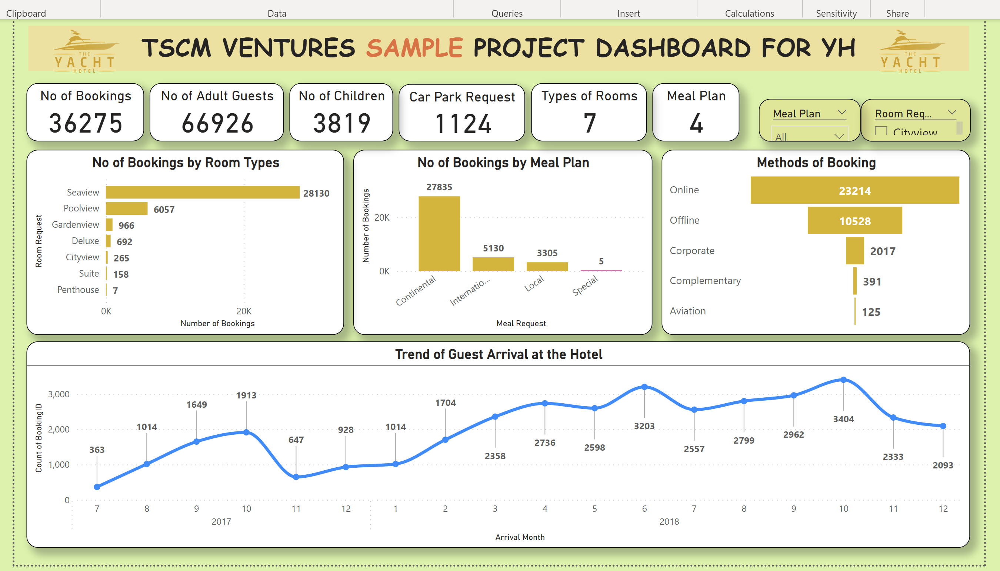
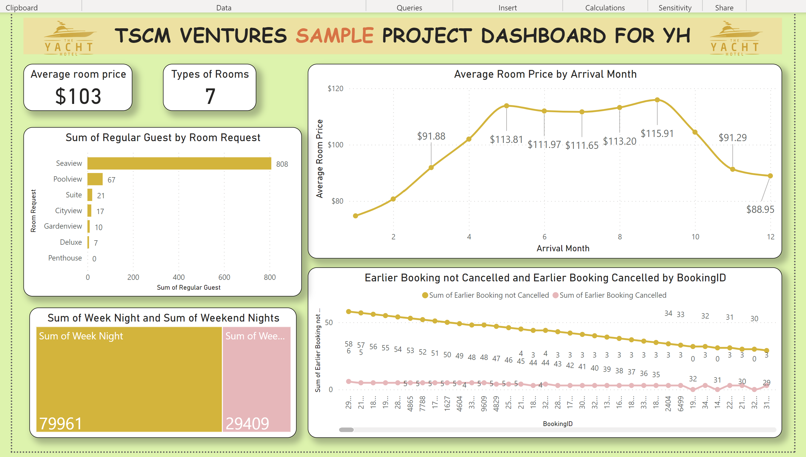
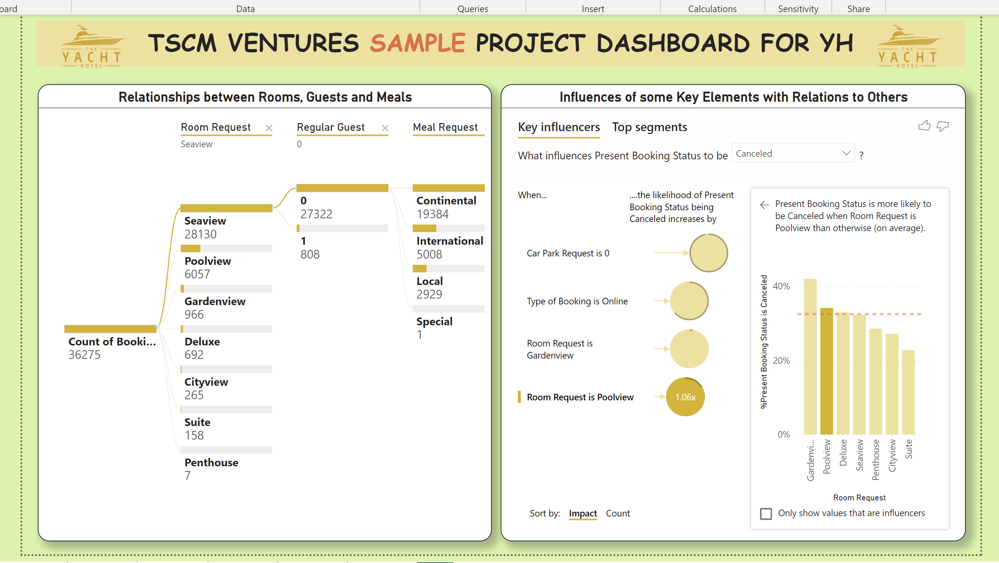

# Proposal: Business/Data Analyst for Hospitality Industry

___

## Inspiration
My discussion with a hospitality industrialist inspired me to write this proposal for the office of a Business/Data Analyst in the hospitality business, which can be applied generally to organizations which are yet to tap into the mysteries and wonders of data analytics.

## Introduction
In everyday life, data is being generated and available in an organization, from transactional data in a traditional database, telemetry monitoring data from services that we use, to signals that we get from different areas like social media.
For example, today's retail businesses, hospitality industries, among many, collect and store massive amounts of data that track the items we browsed and purchased, the pages we've visit on their site, the aisles we purchase products from, the rooms and meals we book, our spending habits, and much more.
Hospitality industries should be able to use their vast amounts of data and information in such a way that impacts their business

In today's highly competitive and fast-paced business world, crafting reports that tell these stories is what helps business leaders act on the data. Business decision makers depend on accurate narratives to drive better business decisions. The faster a business can make precise decisions, the more competitive they will be and the better advantage they will have. Without these stories, it is difficult to understand what the massive data in organisations storages are useful for.
The underlying challenge that businesses face today is understanding and using their data in such a way that impacts their business and ultimately their development. This might seem daunting to business owners, but it is a task that can be accomplished. The first step is to partner with data experts, such as Business/Data Analyst, to help get the data and develop story that you need to help drive decision making process.

## Components of Data Analysis
The main components of Business/Data Analysis are divided into the following categories:
i.	Descriptive analytics
ii.	Diagnostic analytics
iii.	Predictive analytics
iv.	Prescriptive analytics
v.	Cognitive analytics

## Who is a Business/Data Analyst
A Data Analyst enables businesses to maximize the value of their data assets through visualization and reporting tools such as Microsoft Power BI, or Tableau. 
A Business Analyst has similar functions as the Data Analyst. The main difference between the two positions is what they do with data. A Business Analyst is closer to the business and specialises in the interpretation of data that comes from the visualization produced by Data Analyst.
Sometimes, the roles of Data Analyst and Business Analyst can be the responsibilities of a single person.

## The office of Business/Data Analyst
The Office of a Business/Data Analyst is functionally better equipped with a Data Collector, a Data Entry personal and Database Administrator. These roles function to monitor and manage the overall health of a database and the hardware housing the data.
A Database Administrator manages the overall security of the data, granting and restricting user access and privileges to the data as determine by business needs and requirements.

## Resposibilities
A Data Analyst is responsible for profiling, cleaning, and transforming data. Also responsible for designing and building scalable and effective data models, enabling, and implementing the advanced analytics capabilities into reports for analysis. A Data Analyst is task with implementing and configuring proper security procedures, in agreement with stakeholder requirements, to ensure the safekeeping of all analytic tools assets and their data.
Six basic steps of a Data Analyst are: asking questions; getting data; investigating the data; transforming/preparing the data; analysing the data and finally presenting the results to the decision-makers of the organisation.

## Data source
In order to demonstrate the wonders of data analysis in some hospitality industries, data on activies in a hotel was analysed. This was made possible with data aquired from Kaggle dataset on hotel booking demand. The dataset contains 19 columns and 36,275 rows. The data set was cleaned and modifications were made to suit some specific peculiarities. DAX concept in calculated columns, design of calendar in PowerQuery and Power BI concepts were applied.

**_Disclaimer_**: _All datasets and reports do not represent any company, institution or any country, but just a dummy dataset to demonstrate capabilities of Power BI to analyse activities and the importance of the office of a Business/Data Analyst in hospitality industries. Also, **The Yatcht Hotel** picture and name in the dashboard in this proposal are used with special permission. **TSCM Ventures** in the dashboards is not real._

## Aim of the Proposal
The aim of this proposal is to highlight and encourage organisations to make use of numerious benefits of data analysis in their businesses.

## Data Analysis and Visuals
Three analysis and visualisation dashboards of Power BI were included in this proposal

### First dashboard

This shows rate and methods of booking in the form of:
-	methods of booking
-	types of room
-	meal plan
-	trend of arrival at the hotel

It shows that October 2018 made up over 9% of Count of BookingID. Seaview rooms accommodated over 28,000 and was higher than other rooms and accountable for over 77% of number of bookings

### Second dashboard

This shows average room price by arrival month:
-	sum of regular guest by room request
-	booking not cancelled and cancelled
-	number of week nights and weekend nights
There are less booking cancelled than uncancelled. Regular guests prefered the seaview rooms to others

### Third dashboard

Two relationships presented
.between rooms, guests and meal
.Influences of some key elements in booking
-	most regular guests preferred seaview and continental meals
-	likelihood of booking to be cancelled increased with no carparks
The probability of present booking Status being 'Canceled' increased like 3.84 times when Car Park Request was 0.
Some other factors also influenced Present Booking Status to be 'Canceled', which is presented in the key influencers visual.

## Recommendations
In the light of the above, a big organisation needs the services of a Business/Data Analyst to fly high and excel in this competitive world.

A team of two to three experts can work with the organisation to set up a robust Office of Business/Data Analyst within six months to be able to conduct business analysis to assess business problems/opportunities and document the business requirements in such a way that technological solutions can be determined. This can also promote business improvements through alternative service delivery approaches.

## Conclusion
Some pertinent data information Business/Data Analyst shall need include, among other:

For greater performance, efforts must be put in place to boost various aspects of the industry.
Many reasonable KPIs will be set up to measure various performance from different angles to find laudable solutions.

These numerous queries and development of various dashboards are necessary for proper planning and develop future projections for the business to achieve greater results.

## Reference:
1.	https://learn.microsoft.com/en-us/training/modules/get-started-with-power-bi/1-introduction 
2.	Database Administrator (DBA) Roles & Responsibilities in The Big Data Age – BMC Software | Blogs
   

